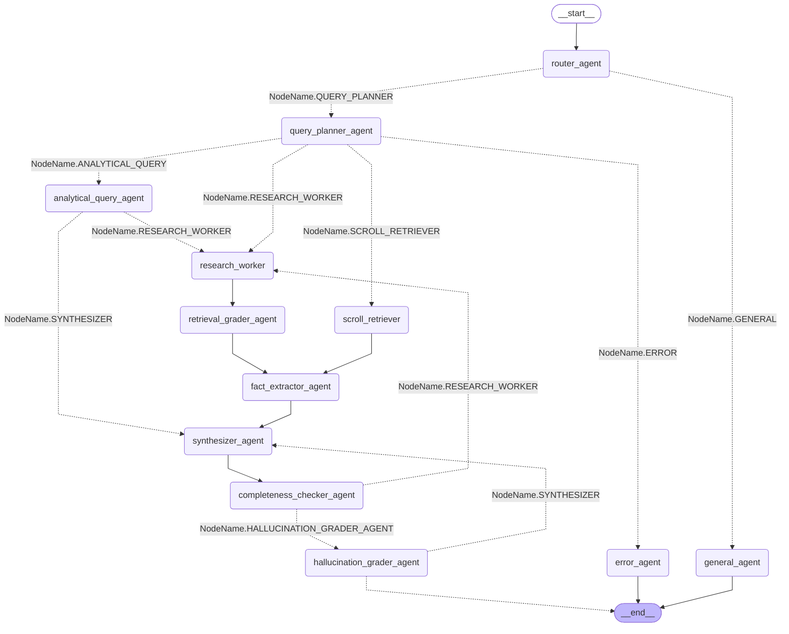

# AgenticRAG

Agentic Retrieval-Augmented Generation (RAG) system built with Python. The system combines a multi-strategy ETL pipeline with a LangGraph agentic workflow to deliver accurate, grounded answers from a mixed document knowledge base.

## Key Features

* **Modern Tooling:** Built using **[uv](https://github.com/astral-sh/uv)** for fast, reliable Python dependency management.
* **Vector Database:** Utilizes **[Qdrant](https://qdrant.tech/)** for high-performance hybrid search (dense + sparse embeddings via SPLADE).
* **Analytical Database:** Uses **[DuckDB](https://duckdb.org/)** (embedded, no extra service) for SQL-based aggregation and ranking queries on tabular data.
* **Smart Ingestion:** Uses **[Docling](https://github.com/DS4SD/docling)** to accurately parse PDFs, DOCX, and PPTX files into clean Markdown.
* **ETL Pipeline:**
    * Converts documents to Markdown (PDF, DOCX, PPTX, MD, TXT, CSV, XLSX).
    * Extracts Markdown tables and stores them in both Qdrant and DuckDB.
    * Cleans and segments text by logical header sections.
    * **Semantic Chunking:** Splits text based on sentence similarity rather than fixed character counts.
    * **Hybrid Embeddings:** Generates both dense and sparse vectors for optimal retrieval.
* **Agentic RAG:** A LangGraph pipeline with specialized agents (Router, QueryPlanner, ResearchWorker, RetrievalGrader, FactExtractor, Synthesizer, CompletenessChecker, HallucinationGrader) that routes each query to the most effective retrieval strategy.

---

## Prerequisites

1. **Docker & Docker Compose:** Required to run Qdrant.
2. **Ollama:** Must be running locally or accessible via network (defaults to `localhost:11434`).
3. **uv:** For Python dependency management.

---

## Installation & Setup

### 1. Start Infrastructure

A `docker-compose.yaml` file is provided that starts **Qdrant** (vector DB). DuckDB runs embedded and requires no separate service.

```bash
docker-compose up -d
```

### 2. Install dependencies

```bash
uv sync
```

### 3. Environment config

Create a `.env` file in the root directory:

```
QDRANT_GRPC_PORT=6334
QDRANT_REST_PORT=6333
COLLECTION_NAME_DROUGH=drough
```

---

## Usage

### 1. Ingest data (ETL)

Process a single file or an entire folder. Supports `.pdf`, `.docx`, `.pptx`, `.md`, `.txt`, `.csv`, `.xlsx`.

```bash
uv run main.py --run-etl --path /path/to/your/folder
```

Erase the existing collection first, then ingest:

```bash
uv run main.py --run-etl --erase --path /path/to/your/folder
```

Use recursive (fixed-size) chunking instead of the default semantic chunking:

```bash
uv run main.py --run-etl --recursive-chunking --path /path/to/your/folder
```

Use a custom embedding model (any fastembed or HuggingFace model):

```bash
uv run main.py --run-etl --embed-model BAAI/bge-m3 --path /path/to/your/folder
```

Specify a custom Qdrant collection name:

```bash
uv run main.py --run-etl --collection-name MyCollection --path /path/to/your/folder
```

### 2. Run chat

```bash
uv run main.py --chat
```

Specify a different LLM model:

```bash
uv run main.py --model llama3.1:8b --chat
```

### 3. Check database status

```bash
uv run main.py --check-dbs
```

---

## Architecture

### Supported File Types

| Extension | Qdrant storage | DuckDB storage | Notes |
|---|---|---|---|
| `.pdf`, `.docx`, `.pptx` | Text chunks + table rows | Extracted tables | Docling converts to Markdown |
| `.md`, `.txt` | Text chunks + table rows | Extracted tables | Processed natively |
| `.csv` | One document per row | Full file as table | All columns stored as typed metadata |
| `.xlsx` | One document per row | Full file as table | All columns stored as typed metadata |

### ETL Flow

1. **Convert**: Docling converts PDF/DOCX/PPTX to Markdown. MD/TXT files are read directly. CSV/XLSX are loaded as DataFrames.
2. **Extract Tables**: Markdown tables are pulled out, each row becomes a separate document with column values as typed metadata. Tables are also registered in DuckDB for SQL queries.
3. **Split**: Remaining text is split by H1-H4 headers into logical sections.
4. **Chunk**: Each section is split using semantic chunking (sentence similarity) or recursive character splitting.
5. **Embed**: Dense (fastembed / sentence-transformers) and sparse (SPLADE) vectors are generated.
6. **Store**: Documents with vectors and metadata are pushed to Qdrant. CSV/XLSX files are also registered in DuckDB.

### Agentic RAG Flow

When you ask a question, a pipeline of agents collaborates:

- **Router**: Classifies the query intent — `general`, `rag`, `rag_exhaustive`, or `rag_summarization`.
- **General Agent**: Answers directly from LLM knowledge for non-retrieval queries.
- **Query Planner**: Selects a retrieval strategy (`VECTOR`, `SQL`, `HYBRID`, `SCROLL`) and generates search queries.
- **Analytical Query Agent**: Executes LLM-generated SQL against DuckDB for aggregation/ranking queries.
- **Research Worker**: Parallel hybrid search workers in Qdrant, one per query.
- **Scroll Retriever**: Fetches all chunks from a specific source (used for summarization and exhaustive queries).
- **Retrieval Grader**: Reranks all retrieved documents with FlashRank and keeps the top results.
- **Fact Extractor**: Extracts only the sentences relevant to the query from each document.
- **Synthesizer**: Generates the final answer with strict source citations.
- **Completeness Checker**: Evaluates whether the answer fully addresses the question. If not, generates a follow-up query and loops back to the Research Worker (up to 3 iterations).
- **Hallucination Grader**: Verifies the answer is grounded in the retrieved context. Retries with the Synthesizer up to 2 times if hallucinations are detected.


