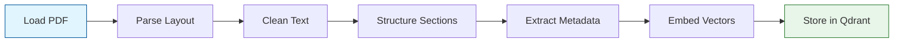
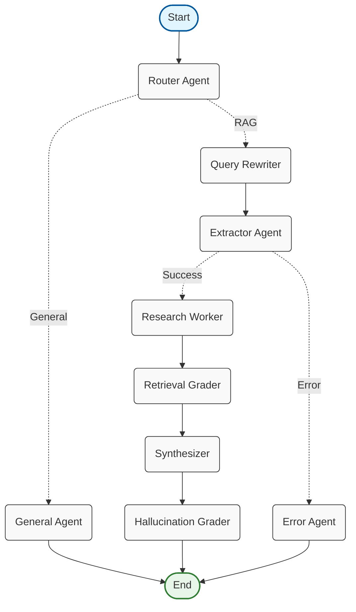

# AgenticRAG

A robust, agent-based Retrieval-Augmented Generation (RAG) system built with Python 3.13+. This project leverages advanced ETL pipelines and agentic workflows to deliver high-quality answers from your document knowledge base.

## Key Features

* **Modern Tooling:** Built using **[uv](https://github.com/astral-sh/uv)** for fast, reliable Python dependency management.
* **Vector Database:** Utilizes **[Qdrant](https://qdrant.tech/)** for high-performance hybrid search (Dense + Sparse embeddings).
* **Smart Ingestion:** Uses **[Docling](https://github.com/DS4SD/docling)** to accurately parse PDFs into clean Markdown.
* **ETL Pipeline:**
    * Converts documents to Markdown.
    * Cleans and segments text by logical sections.
    * **AI-Powered Extraction:** Extracts metadata (Topics, Country, Year, City) from sections using LLMs.
    * **Semantic Chunking:** Splits text based on similarity rather than fixed character counts.
    * **Hybrid Embeddings:** Generates both dense and sparse vectors for optimal retrieval.
    * **NOTE: THIS ETL PIPELINE IS NOT YET READY FOR ALL SORTS OF DATA.**
* **Agentic RAG:** Uses a graph of specialized agents (Router, Rewriter, Extractor, Grader, Synthesizer) to ensure accurate and grounded answers.

---

## Prerequisites

This project requires a set of infrastructure services to be running before the Python application can start. We provide a `docker-compose.yaml` file to handle the core services.

1.  **Docker & Docker Compose:** Required to run the database and embedding API.
2.  **Ollama:** Must be running locally or accessible via network (defaults to `localhost:11434`).
3.  **uv:** For Python dependency management.

---

## Installation & Setup

### 1. Start Infrastructure
`docker-compose.yaml` file provided that starts up **Qdrant** (Vector DB) and the **Text Embedding API**. You **must** run this before starting the RAG application.

```bash
docker-compose up -d
```

### 2. Install dependencies
Clone the repository and sync Python dependencies using `uv`.
```bash
uv sync
```

### 3. Enviroment config
Create `.env` file in the root dir to configure settings, that can look like this:
```
FRONTEND_PORT=8081
BACKEND_PORT=8000
CHROMA_PORT=8001
QDRANT_GRPC_PORT=6334
QDRANT_REST_PORT=6333
WEAVIATE_HTTP_PORT=8080
WEAVIATE_GRPC_PORT=50051

VECTOR_DB_VECTOR_SIZE=384
VECTOR_DB_DISTANCE=DOT
COLLECTION_NAME_DROUGH=Drough
```

## Usage

### 1. Ingest data (ETL)
Before chatting, you must populate the vector database. This command processes all PDFs in a specified folder.
**!IMPORTANT! this ETL is not yet ready for all kinds of data, now it only works with 'drough' data, that are in this directory in data/drought/**
```bash
uv run main.py --run-etl --path /path/to/your/pdf_folder
```

Run ETL and erase existing collection first
```bash
uv run main.py --run-etl --erase-db --path /path/to/your/pdf_folder
```

### 2. Run chat
Once the database is populated, start the RAG chat mode to ask questions.
```bash
uv run main.py --chat
```

### 3. Check database status
Verify how many documents are currently indexed in your Qdrant collection.
```bash
uv run main.py --check-dbs
```

## Architecture
### ETL Flow
1. **Load**: Read PDF files from the directory.
2. **Parse**: Docling converts PDF layout to structured Markdown.
3. **Clean**: Remove artifacts and noise.
4. **Structure**: Split text into logical sections.
5. **Extract**: An LLM agent analyzes sections to extract metadata (e.g., {"country": "Switzerland", "year": "2022"}).
6. **Embed**: Generate vectors (Dense + Sparse).
7. **Store**: Push payload and vectors to Qdrant.



### Agentic RAG Flow
When you ask a question, a team of agents collaborates:
- **Router**: Decides if the question needs database retrieval or general knowledge.
- **Query Rewriter**: Optimizes the user's query for better search results.
- **Extractor**: Pulls specific filters (Year, Location) from the query.
- **Worker**: Performs Hybrid Search in Qdrant with "Smart Filtering".
- **Grader**: Evaluates retrieved documents for relevance.
- **Synthesizer**: Generates the final grounded answer.

